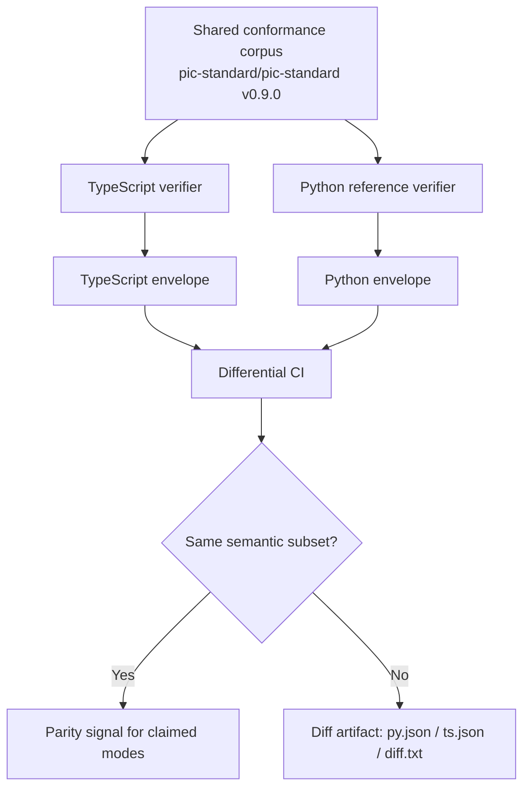

# PIC Standard TypeScript

[](https://github.com/pic-standard/pic-standard-ts/actions/workflows/ci.yml)
[](LICENSE)


**Make AI-agent tool calls checkable before they execute.**

> **v0.9.0 (2026-09-21):** First v0.9.0 release of the TypeScript verifier. Passes the shared conformance corpus from [`pic-standard/pic-standard@v0.9.0`](https://github.com/pic-standard/pic-standard/releases/tag/v0.9.0) for `canonicalization`, `core`, and `trust_sanitization`. Published to npm as `@pic-standard/pic-standard-ts@0.9.0`. Install with `npm install @pic-standard/pic-standard-ts`. Evidence-mode parity remains a v0.9.x completion item.

PIC Standard, short for **Provenance & Intent Contracts**, is a protocol
for controlling AI-agent actions with structured intent, impact,
provenance, and evidence.

This repository is the TypeScript implementation track for PIC. It brings
PIC verification primitives to Node.js, backend services, tool gateways,
MCP-style integrations, workflow engines, and agent runtimes where AI
systems can call real tools.

## Why PIC?

AI agents are starting to do more than generate text. They can call APIs,
write files, send messages, access private data, update records, and
trigger payments.

In those systems, this is not enough:

```json
{ "trust": "trusted" }
```

PIC makes the action prove more of its context before it runs:

- What is the agent trying to do?
- What kind of impact can the action have?
- Where did the claimed authority come from?
- Which claims are backed by evidence?
- Does the requested tool match the authorized tool?
- Should high-impact actions fail closed unless provenance is trusted?

The goal is not to make the model smarter. The goal is to make agent
actions more controllable, auditable, portable, and safer to operate.

## What works today

This TypeScript implementation currently supports:

- PIC-CJSON/1.0 canonicalization
- Proposal schema validation
- Core verifier decisions:
  - duplicate provenance-id rejection
  - strict-trust sanitization
  - exact tool binding
  - high-impact causal contract checks
- Trust-sanitization parity against the vendored 24-vector matrix
- A conformance runner for the claimed modes
- An advisory differential CI job comparing the TypeScript envelope
  against the Python reference verifier on the same pinned corpus

The library surface provides PIC-CJSON canonicalization, proposal schema
validation, the `PICErrorCode` mirror, and `verifyProposal()` for core
verifier decisions with trust-sanitization behavior. The tooling surface
provides a conformance runner in `src/run.ts`, invoked after build via
`node dist/run.js`.

Current claimed modes:

```
canonicalization
core
trust_sanitization
```

Not yet implemented in v0.9.0:

- evidence-mode parity
- signature verification
- evidence-derived trust
- HTTP bridge parity
- npm release parity with the Python package

This package is prepared for publication to npm as `@pic-standard/pic-standard-ts@0.9.0`. After publication, install with `npm install @pic-standard/pic-standard-ts`. It should not yet be treated as implementing full PIC evidence-mode verifier semantics: evidence-mode parity remains a v0.9.x completion item.

## Tiny example

Repo-local example:

```typescript
import { verifyProposal } from './src/index.js';

const result = verifyProposal({
  protocol: 'PIC/1.0',
  intent: 'send approved refund',
  impact: 'money',
  provenance: [{ id: 'ticket-approval', trust: 'trusted' }],
  claims: [{ text: 'refund was approved', evidence: ['ticket-approval'] }],
  action: {
    tool: 'refund.create',
    args: { amount: 50, currency: 'EUR' },
  },
});

if (!result.allowed) {
  console.error(result.error.code, result.error.message);
}
```

With the default secure trust mode, self-asserted trust is sanitized
before high-impact actions are allowed, so this proposal fails closed in
the current v0.9.0 TypeScript scope.

## Conformance

This repo consumes the canonical PIC conformance corpus as a git submodule:

```
vendor/pic-standard/
```

The current target is:

```
pic-standard/pic-standard@v0.9.0
```

Run the claimed-mode conformance suite:

```bash
npm run conformance
```

Emit the JSON envelope used by future differential CI. The `--silent`
flag suppresses npm's script header so the envelope on stdout is
machine-parseable:

```bash
npm run --silent conformance:json
```

The runner covers only the claimed modes. Explicit
`--filter-mode evidence` fails closed because evidence-mode parity is not
implemented in this TypeScript build.

## Differential CI

An advisory CI job runs on every push to `main` and every PR into
`main` to compare this TypeScript implementation's conformance
envelope against the Python reference verifier's, on the same pinned
vendored corpus.



Both runners emit their JSON envelope for the three claimed modes
(canonicalization, core, trust_sanitization). A small Python diff
script projects each envelope to the semantic subset that matters for
cross-language parity: `summary`, `exit_code`, and
`results[] | {id, passed, reason_code}` in emitted order. It then
canonicalizes with sorted keys and byte-compares.

Evidence-mode is deliberately unimplemented in TypeScript and is not
part of the differential contract.

The job is **advisory**: a red diff surfaces real signal but does not
block merges. Release-tag gating, where this diff becomes required
for release tags, is deferred to a later block.

To reproduce locally you need Python 3.11 and the vendored source:

```bash
python -m pip install ./vendor/pic-standard
npm run --silent conformance:json > ts.json
( cd vendor/pic-standard && \
    python -m conformance.run --manifest conformance/manifest.json \
      --filter-mode canonicalization --filter-mode core \
      --filter-mode trust_sanitization --json ) > py.json
python scripts/diff_conformance.py py.json ts.json
```

Exit 0 means the projected subsets match. Exit 1 means they differ and
a unified diff is written to stderr.

## Getting started

Clone with submodules so the vendored `pic-standard` corpus is available:

```bash
git clone --recurse-submodules https://github.com/pic-standard/pic-standard-ts.git
cd pic-standard-ts
npm ci
```

Run the check set:

```bash
npm run format:check
npm run lint
npm run typecheck
npm test
npm run build
npm run conformance
```

## Repository layout

```
pic-standard-ts/
├── src/                   TypeScript source
├── test/                  Vitest test suite
├── vendor/pic-standard/   git submodule pinned to pic-standard/pic-standard v0.9.0
├── .github/workflows/     GitHub Actions CI
├── eslint.config.mjs      ESLint flat config
├── tsconfig.json          TypeScript compiler options
└── package.json
```

## Relationship to `pic-standard`

The canonical PIC Standard specification and Python reference implementation
live at
[`pic-standard/pic-standard`](https://github.com/pic-standard/pic-standard).
That repository defines the protocol, hosts the conformance manifest and
vectors, and ships the Python verifier that this TypeScript implementation
is measured against.

This repository is not a second specification. It is a second
implementation, measured against the same conformance vectors. The goal is
language portability: Python and TypeScript implementations should agree
on the same protocol behavior.

## Contributing

Contributions are welcome, especially around:

- TypeScript verifier parity
- Conformance and differential testing
- MCP and tool-router integrations
- Agent runtime adapters (LangGraph JS, OpenAI Agents SDK JS, n8n)
- Documentation and examples
- Security review of edge cases

Before opening a PR, run:

```bash
npm run format:check
npm run lint
npm run typecheck
npm test
npm run build
npm run conformance
```

All commits require DCO sign-off. See
[`CONTRIBUTING.md`](CONTRIBUTING.md) for setup, development workflow,
coding style, and how to submit changes.

## License

Apache-2.0. See [`LICENSE`](LICENSE).
